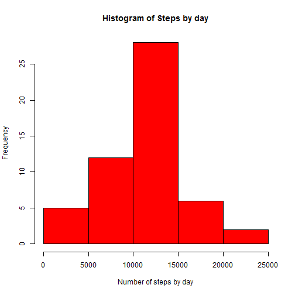
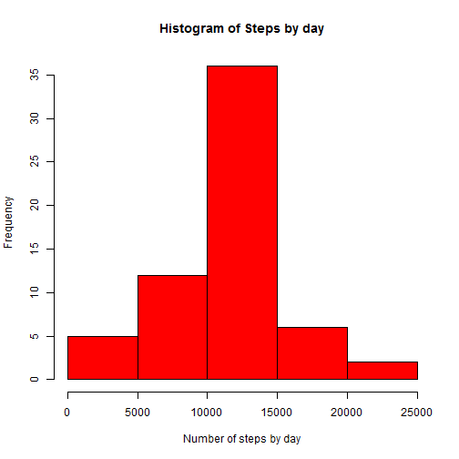
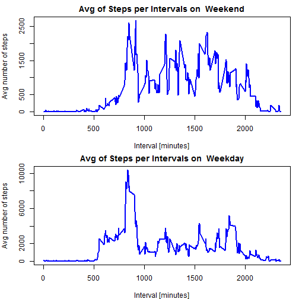

### Getting, loading and preprocessing the data.

The data is downloaded from the https://d396qusza40orc.cloudfront.net/repdata%2Fdata%2Factivity.zip and unzipped in the data folder.  Next, null values are cleaned from the dataset.


```r
filename = "./data/activity.csv"

## Getting the zip file, and unzipping it.
if (!file.exists(filename)) {
      
      fileUrl <- "https://d396qusza40orc.cloudfront.net/repdata%2Fdata%2Factivity.zip"
      zipfile <- "./data/repdata-data-activity.zip"
      download.file(url=fileUrl, destfile=zipfile)
      unzip(zipfile, exdir = "./data")
}

allData <- read.csv(filename, colClasses = c("numeric", "Date", "numeric"), na.strings = NA)
activityData <- allData[complete.cases(allData), ] 

head(activityData)
```

```
##     steps       date interval
## 289     0 2012-10-02        0
## 290     0 2012-10-02        5
## 291     0 2012-10-02       10
## 292     0 2012-10-02       15
## 293     0 2012-10-02       20
## 294     0 2012-10-02       25
```

### What is mean total number of steps taken per day?

First, we need to aggregate the data by date.

```r
StepsByDate <- aggregate(steps ~ date, data = activityData, sum, na.rm = TRUE)
head(StepsByDate)
```

```
##         date steps
## 1 2012-10-02   126
## 2 2012-10-03 11352
## 3 2012-10-04 12116
## 4 2012-10-05 13294
## 5 2012-10-06 15420
## 6 2012-10-07 11015
```
The histogram for the Total Steps by Day:

```r
hist(StepsByDate$steps, main = "Histogram of Steps by day", xlab = "Number of steps by day", col = "red")
```

 

The median and mean of Stebs by day:

```r
meanStepsByDate <- mean(StepsByDate$steps)
meanStepsByDate
```

```
## [1] 10766.19
```

```r
medianStepsByDate <- median(StepsByDate$steps)
medianStepsByDate
```

```
## [1] 10765
```

### What is the average daily activity pattern?
First, the mean of steps taken by days is computed

```r
intervalMeans <- aggregate(steps ~ interval, data = allData, mean, na.rm = TRUE)
head(intervalMeans)
```

```
##   interval     steps
## 1        0 1.7169811
## 2        5 0.3396226
## 3       10 0.1320755
## 4       15 0.1509434
## 5       20 0.0754717
## 6       25 2.0943396
```
The Time-Series for the mean of Steps taken by day:

```r
plot(intervalMeans$interval, 
     intervalMeans$steps, 
     type="l", 
     col="blue", 
     lwd=2, 
     xlab="Interval [minutes]", 
     ylab="Average number of steps", 
     main="Time-series of the average number of steps per intervals\n(NA removed)")
```

 

Which 5-minute interval, on average across all the days in the dataset, contains the maximum number of steps?

```r
maxInterval <- intervalMeans[which.max(intervalMeans$steps),]
```
The interval with the max mean of steps taken by day is the # 835

### Imputing missing values

```r
numMissingValues <- length(which(is.na(allData$steps)))
```
There are 2304 missing values on the dataset.

#### Strategy
We are going to fill in this NA values with the average steps for their interval using the dataset we used in the Time-series.

```r
#First, I'll rename column "steps" to represent "avgIntervalSteps"
names(intervalMeans)[names(intervalMeans)=="steps"] <- "avgIntervalSteps"

#Now merge the Average Interval Steps back into the dataframe by interval
allDataWithAvg <- merge(x=allData,y=intervalMeans, by="interval", all.x=TRUE)

allDataWithAvg$imputedSteps <- ifelse(is.na(allDataWithAvg$steps), 
                                          allDataWithAvg$avgIntervalSteps, #replace nulls
                                          allDataWithAvg$steps) #if they have value, stay with it
                                 
head(allDataWithAvg)
```

```
##   interval steps       date avgIntervalSteps imputedSteps
## 1        0    NA 2012-10-01         1.716981     1.716981
## 2        0     0 2012-11-23         1.716981     0.000000
## 3        0     0 2012-10-28         1.716981     0.000000
## 4        0     0 2012-11-06         1.716981     0.000000
## 5        0     0 2012-11-24         1.716981     0.000000
## 6        0     0 2012-11-15         1.716981     0.000000
```

The histogram for the Total Steps by Day with the Imputed Values:

```r
StepsByDate <- aggregate(imputedSteps ~ date, data = allDataWithAvg, sum, na.rm = TRUE)
hist(StepsByDate$imputedSteps, main = "Histogram of Steps by day", xlab = "Number of steps by day", col = "red")
```

 

Then we compare the mean and median for the Dataframe with NA, and the new dataframe with imputed values.
The median and mean of Stebs by day:

```r
meanStepsByDate_Imputed <- mean(StepsByDate$imputedSteps)
meanStepsByDate_Imputed
```

```
## [1] 10766.19
```

```r
meanStepsByDate
```

```
## [1] 10766.19
```

```r
medianStepsByDate_Imputed <- median(StepsByDate$imputedSteps)
medianStepsByDate_Imputed
```

```
## [1] 10766.19
```

```r
medianStepsByDate
```

```
## [1] 10765
```

There is not significantly change in the mean and median after imputing the values for the NA.  
Mean before fill-in: 1.07662 &times; 10<sup>4</sup> vs 1.07662 &times; 10<sup>4</sup> after fill-in
Median before fill-in: 1.0765 &times; 10<sup>4</sup> vs 1.0766 &times; 10<sup>4</sup> after fill-in

### Are there differences in activity patterns between weekdays and weekends?
Firt at all, we need to add a flag for those days that correspond to weekend and weekdays.

```r
allDataWithAvg$weekday <- weekdays(allDataWithAvg$date)
allDataWithAvg$weekendFlag <- ifelse(allDataWithAvg$weekday=="Saturday" | allDataWithAvg$weekday == "Sunday", "Weekend", "Weekday")
head(allDataWithAvg)
```

```
##   interval steps       date avgIntervalSteps imputedSteps  weekday
## 1        0    NA 2012-10-01         1.716981     1.716981   Monday
## 2        0     0 2012-11-23         1.716981     0.000000   Friday
## 3        0     0 2012-10-28         1.716981     0.000000   Sunday
## 4        0     0 2012-11-06         1.716981     0.000000  Tuesday
## 5        0     0 2012-11-24         1.716981     0.000000 Saturday
## 6        0     0 2012-11-15         1.716981     0.000000 Thursday
##   weekendFlag
## 1     Weekday
## 2     Weekday
## 3     Weekend
## 4     Weekday
## 5     Weekend
## 6     Weekday
```

Then we make a panel plot containing a time series plot of the 5-minute interval and the average number of steps taken, averaged across all weekday days or weekend days.

```r
par(mfrow = c(2, 1))
par(mar = c(4, 4, 2, 1)) 
for (dayType in c("Weekend", "Weekday")) {

      StepsByDate <- aggregate(imputedSteps ~ interval, data = allDataWithAvg,  subset = allDataWithAvg$weekendFlag == dayType, sum, na.rm = TRUE)
      
      plot(StepsByDate$interval, 
           StepsByDate$imputedSteps, 
           type="l", 
           lwd=2,
           col="blue", 
           xlab="Interval [minutes]", 
           ylab="Avg number of steps", 
           main = paste("Avg of Steps per Intervals on ", dayType))
           
}
```

 
